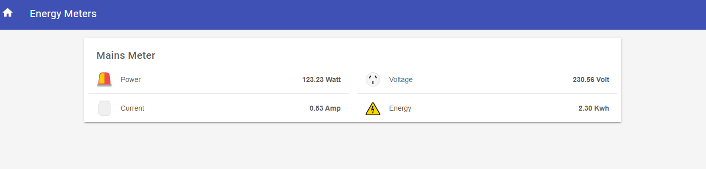

# MQTT Based Energy Meter with OpenHAB


## Setting up with OpenHAB

1. If MQTT addon is not installed,

    Goto `OpenHAB Paper UI -> Ad-ons -> Bindings` and search for mqtt. Make sure to install the `2.x` listing of it.
        
    
    
    
2. Create required Things/Items

    > There are 2 ways of creating the required things/items in OpenHAB, using the paper UI and through text files. Over here I am going to use the text files way, as this makes managing and backing up easy.

    #### If you have not created a broker already,
        
    Navigate to  `things` folder in your OpenHAB installation. For `OpenHabian` it is `/etc/openhab2/things`.

    Create a new file `boker.things` and paste the following content.

    ```json
    Bridge mqtt:broker:localMosquitto "Mosquitto" [ host="192.168.0.7", port="1883", secure=false, username="", password="", clientID="A_RANDOM_String" ]
    ```

    > Make sure to change the content (host,port, username, password) as per your setup/installation.

    #### Create `Thing/Channels` for Energy Meter

    Navigate to  `things` folder in your OpenHAB installation. For `OpenHabian` it is `/etc/openhab2/things`.

    Create a new file `energy_meter.things` and paste the following contents,

    ```js
    Thing mqtt:topic:localMosquitto:EnergyMeter "Energy Meter" (mqtt:broker:localMosquitto)  {
        Channels:
            Type number : power "Power" [ stateTopic="home/energymeter/93/data", transformationPattern="JSONPATH:$.POWER" ]
            Type number : voltage "Voltage" [ stateTopic="home/energymeter/93/data", transformationPattern="JSONPATH:$.VOLT" ]
            Type number : current "Current" [ stateTopic="home/energymeter/93/data", transformationPattern="JSONPATH:$.AMP" ]
            Type number : energy "Energy" [ stateTopic="home/energymeter/93/data", transformationPattern="JSONPATH:$.ENERGY" ]
    }
    ```

    >Make sure to change the mqtt topic as per your conveneince. I have subsribed to smae topic and using `JSONPath Transformation` to parse the incoming `JSON` data. To use this however you need to have `JSONPath Transformation` add on for OpenHAB installed. This can be done from `TRANSFORMATIONS` tab in `Add-ons` in `PAPER UI`.


    #### Create Items

     Navigate to  `items` folder in your OpenHAB installation. For `OpenHabian` it is `/etc/openhab2/items`.

    Create a new file `energy_meter.items` and paste the following contents,

    ```js
    Group gEnergyMeter
    Number  EnergyMeterPower "Power [%.2f Watt]" <alarm> (gEnergyMeter) { channel="mqtt:topic:localMosquitto:EnergyMeter:power" }
    Number  EnergyMeterVoltage "Voltage [%.2f Volt]" <poweroutlet_au>(gEnergyMeter) { channel="mqtt:topic:localMosquitto:EnergyMeter:voltage" }
    Number  EnergyMeterCurrent "Current [%.2f Amp]" <cistern> (gEnergyMeter) { channel="mqtt:topic:localMosquitto:EnergyMeter:current" }
    Number  EnergyMeterEnergy "Energy [%.2f Kwh]" <energy> (gEnergyMeter)  { channel="mqtt:topic:localMosquitto:EnergyMeter:energy" }
    ```

    > I have added icons which are available by default with OpenHAB, which donot justify the parameters. You can change that and add icons of your choice.
     
    ### Add the items to a sitemap 

    > You can either add the items individually or add the group straight away to the sitemaps file.

    Navigate to  `sitemaps` folder in your OpenHAB installation. For `OpenHabian` it is `/etc/openhab2/sitemaps`. Create a file `energy_meter.sitemap` and pasgte the following contents, 

    ```js
    sitemap test label="Energy Meters"
    {	
        Frame label="Mains Meter"{
            Text item=EnergyMeterPower
            Text item=EnergyMeterVoltage
            Text item=EnergyMeterCurrent
            Text item=EnergyMeterEnergy
        }
    }
    ```
 
    


    Enjoy !!


    


